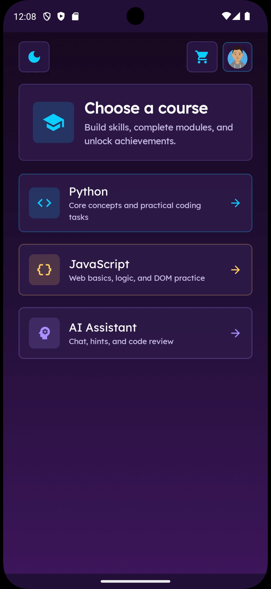
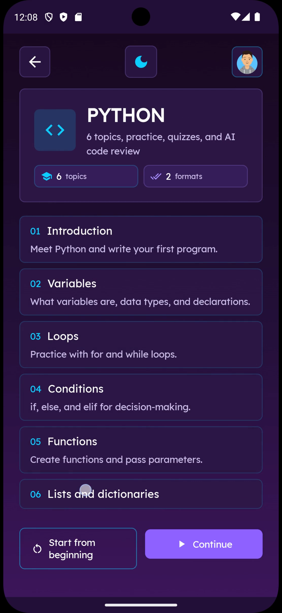
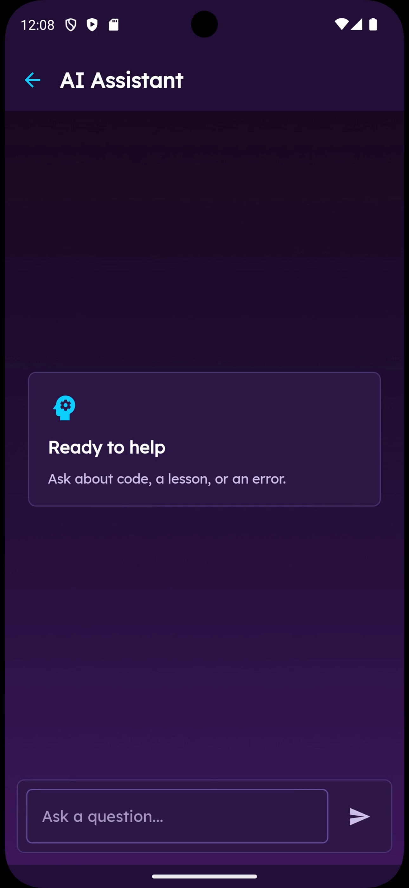
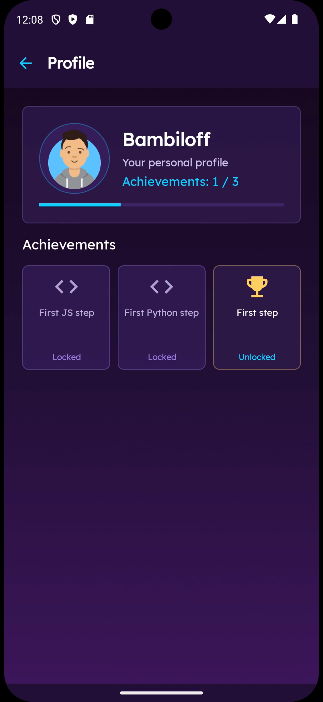

<div align="center">

# Kvantor

### Interactive Android application for learning programming

Learn Python and JavaScript through structured modules, practical exercises,
quizzes, progress tracking, achievements, and AI-assisted learning.


</div>

---

## Overview

Kvantor is an Android learning application designed to make introductory
programming education more interactive.

The application allows users to create an account, configure a profile,
choose between Python and JavaScript courses, open structured learning
modules, complete quizzes and coding tasks, track progress, unlock
achievements, and communicate with an AI assistant.

The project was developed as a portfolio and university project to
demonstrate practical Android development with Kotlin, Jetpack Compose,
Firebase, Firestore, Retrofit, Coroutines, and Material 3.

---

## Screenshots

<table>
  <tr>
    <td align="center" width="50%">
      
      <br>
      <strong>Course Selection</strong>
      <br>
      Choose Python, JavaScript, or open the AI Assistant.
    </td>
    <td align="center" width="50%">
      
      <br>
      <strong>Python Course</strong>
      <br>
      Structured topics, practical exercises, quizzes, and code review.
    </td>
  </tr>
  <tr>
    <td align="center" width="50%">
      
      <br>
      <strong>AI Assistant</strong>
      <br>
      Ask questions about programming, lessons, code, and errors.
    </td>
    <td align="center" width="50%">
      
      <br>
      <strong>Profile and Achievements</strong>
      <br>
      Track personal progress and unlocked achievements.
    </td>
  </tr>
</table>

---

## Main Features

### Authentication and Profile

- Email and password registration
- Email and password login
- Firebase Authentication integration
- User profile setup
- Nickname selection
- Avatar selection
- Persistent user information
- Authentication-aware application flow
- Logout support

### Programming Courses

- Python learning course
- JavaScript learning course
- Structured topic navigation
- Course overview pages
- Introduction modules
- Variables
- Loops
- Conditions
- Functions
- Lists and dictionaries
- Course restart option
- Continue from saved progress

### Interactive Learning

- Theory pages
- Multiple-choice questions
- Coding exercises
- Manual lesson navigation
- Answer validation
- Learning progress tracking
- Module completion state
- Firestore-backed progress storage
- AI-assisted code review support

### Gamification

- Lives system
- Hints system
- Coins
- Achievement tracking
- Progress indicator
- Locked and unlocked achievements
- In-application shop
- Life and hint purchases

### AI Assistant

- Dedicated chat-style interface
- User and assistant messages
- Programming question support
- Lesson explanation support
- Error analysis
- Code-related assistance
- Retrofit-based backend communication
- Kotlin Coroutines for asynchronous requests

### Interface

- Jetpack Compose UI
- Material 3 components
- Dark theme
- Light theme
- Responsive layouts
- Custom purple and cyan visual identity
- Reusable application components
- Loading and error states

---

## Learning Flow

```text
Splash screen
→ Authentication
→ Registration or login
→ Profile setup
→ Welcome screen
→ Course selection
→ Python or JavaScript course
→ Topic selection
→ Theory
→ Quiz
→ Coding task
→ Progress update
→ Achievement unlock
```

The AI Assistant, profile, achievements, and shop can be accessed from the
main application flow.

---

## Technology Stack

### Android

- Kotlin
- Android SDK
- Jetpack Compose
- Material 3
- AndroidX Lifecycle
- ViewModel
- Kotlin Coroutines
- Gradle Kotlin DSL

### Firebase

- Firebase Authentication
- Cloud Firestore
- Google Services Gradle plugin
- Firestore-backed user profiles
- Firestore-backed course progress
- Firestore-backed gamification data

### Networking

- Retrofit
- Gson Converter
- OkHttp
- OkHttp Logging Interceptor
- Local REST API integration

### Testing

- JUnit
- AndroidX Test
- Espresso
- Jetpack Compose UI testing
- Compose test tags

---

## Project Configuration

```text
Application ID: com.bambiloff.kvantor
Minimum Android SDK: 21
Target Android SDK: 35
Compile Android SDK: 35
Java compatibility: 11
Gradle JDK: 17 recommended
```

---

## Project Structure

```text
app/
├── src/
│   ├── main/
│   │   ├── java/com/bambiloff/kvantor/
│   │   │   ├── SplashActivity.kt
│   │   │   ├── AuthActivity.kt
│   │   │   ├── RegisterActivity.kt
│   │   │   ├── ProfileSetupActivity.kt
│   │   │   ├── WelcomeActivity.kt
│   │   │   ├── CourseSelectionActivity.kt
│   │   │   ├── MainActivity.kt
│   │   │   ├── JavaScriptMainActivity.kt
│   │   │   ├── LessonActivity.kt
│   │   │   ├── AiAssistantActivity.kt
│   │   │   ├── AiAssistantScreen.kt
│   │   │   ├── AiAssistantViewModel.kt
│   │   │   ├── AiRepository.kt
│   │   │   ├── ProfileActivity.kt
│   │   │   └── ShopActivity.kt
│   │   ├── res/
│   │   └── AndroidManifest.xml
│   ├── androidTest/
│   └── test/
├── build.gradle.kts
└── google-services.json
```

The project uses several Android activities together with Jetpack Compose
screens, ViewModels, Firebase services, and repository classes.

---

## Firebase Integration

Kvantor uses Firebase for user authentication and application data.

Firebase services used by the application:

- Firebase Authentication
- Cloud Firestore

Firestore stores information such as:

```text
User profile
Nickname
Avatar
Selected course
Learning progress
Completed modules
Achievements
Lives
Hints
Coins
```

To connect the application to another Firebase project:

1. Create a Firebase project.
2. Register an Android application with the package:

```text
com.bambiloff.kvantor
```

3. Enable Email/Password authentication.
4. Create a Cloud Firestore database.
5. Download the Firebase configuration file.
6. Place it at:

```text
app/google-services.json
```

7. Configure the required Firestore collections and documents.

---

## AI Assistant

The AI Assistant communicates with a local backend service through Retrofit.

Default emulator backend address:

```text
http://10.0.2.2:5000/
```

Request endpoint:

```text
POST /ask
```

Request body:

```json
{
  "prompt": "Explain Python variables"
}
```

Expected response:

```json
{
  "response": "A variable is a named value stored in memory..."
}
```

For the Android Emulator, `10.0.2.2` points to the host computer.

When using a physical Android device, replace the backend address with the
local network IP address of the computer running the backend.

The main application can be opened without the AI backend, but sending
messages through the AI Assistant requires a compatible server.

---

## Getting Started

### Requirements

- Android Studio
- JDK 17
- Android SDK 35
- Android Emulator or physical Android device
- Firebase project
- Internet connection for Firebase features
- Optional local backend for the AI Assistant

### Clone the Repository

```bash
git clone https://github.com/vladwpnz/kvantor-android-learning-app.git
cd kvantor-android-learning-app
```

### Open the Project

1. Open Android Studio.
2. Select **Open**.
3. Choose the root `kvantor-android-learning-app` folder.
4. Wait for Gradle synchronization.
5. Select the `app` run configuration.
6. Choose an Android Emulator or physical device.
7. Run the application.

### Build from the Command Line

On Windows:

```powershell
.\gradlew.bat clean
.\gradlew.bat assembleDebug
```

On macOS or Linux:

```bash
./gradlew clean
./gradlew assembleDebug
```

The generated APK is normally located at:

```text
app/build/outputs/apk/debug/app-debug.apk
```

---

## Current Limitations

- The AI Assistant requires a separately running backend
- Course content is limited to Python and JavaScript
- Some learning content depends on existing Firestore data
- No production backend deployment is included
- No offline synchronization
- No push notifications
- No production release signing configuration
- The application uses an activity-oriented structure rather than a single navigation graph

---

## Roadmap

- Expand Python and JavaScript course content
- Add additional programming languages
- Improve coding-task evaluation
- Deploy the AI backend
- Add offline lesson support
- Add push notifications
- Add more achievements
- Synchronize progress across devices
- Improve automated test coverage
- Prepare a production Android release

---

## Author

**Vladyslav Spyrydonov**

GitHub: [@vladwpnz](https://github.com/vladwpnz)

Repository:
[vladwpnz/kvantor-android-learning-app](https://github.com/vladwpnz/kvantor-android-learning-app)

---

<div align="center">

Kvantor is an independently developed Android learning project.

Built with Kotlin, Jetpack Compose, Firebase, and Retrofit.

</div>
